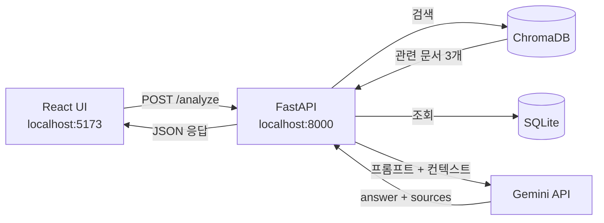

### Building and running your application

When you're ready, start your application by running:
`docker compose up --build`.

Your application will be available at http://localhost:8000.

### Deploying your application to the cloud

First, build your image, e.g.: `docker build -t myapp .`.
If your cloud uses a different CPU architecture than your development
machine (e.g., you are on a Mac M1 and your cloud provider is amd64),
you'll want to build the image for that platform, e.g.:
`docker build --platform=linux/amd64 -t myapp .`.

Then, push it to your registry, e.g. `docker push myregistry.com/myapp`.

Consult Docker's [getting started](https://docs.docker.com/go/get-started-sharing/)
docs for more detail on building and pushing.

### References
* [Docker's Python guide](https://docs.docker.com/language/python/)

## 아키텍처 (README 에 적용하기)

